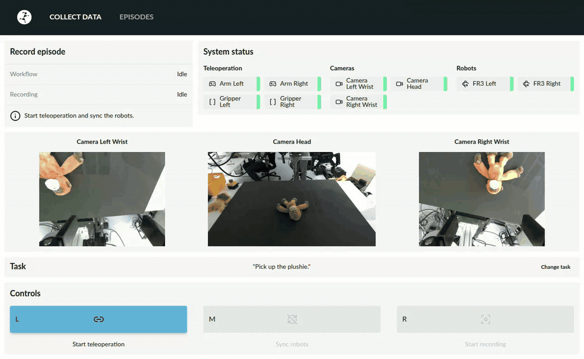

⚠️ **PROTOTYPE:** This software stack is under development and subject to breaking changes.

# LABS

**L**earning & **A**cquisition of **B**ehaviors **S**uite

See the [Changelog](CHANGELOG.md) for release details.



## Overview

Microservice-driven robotics data orchestration platform that coordinates actuators, sensors, and input devices in a
unified pipeline.

### Architecture

LABS runs a set of containerized services grouped by role: input devices, sensors, actuators, and pipeline services.
Users interact with the data collection UI, which triggers data recording for the ROS 2 nodes of actuators, input
devices and sensors. A processing service saves episodes in MCAP format, allowing users to build datasets and export
them in LeRobot format v2.1.

**Typical Workflow**: Configure hardware (station) → Start software stack and collect episodes via the UI →
Automatically process and save in MCAP format → Replay and analyze through the UI _(Not yet available)_ → Export to a
dataset with the desired format for model training

For a detailed architecture diagram, see the [Architecture Diagram](docs/labs-architecture.svg).

### Technology Stack

- Local orchestration/dev workflow: Docker Compose, Tilt, and `go-task` Taskfiles
- FastAPI + Uvicorn ASGI server with async/await
- Python 3.12+ with `uv` package manager
- ROS 2 Jazzy
- Recording/export via `ros2 bag` in MCAP format
- Dataset export format: LeRobot v2.1
- Media processing: FFmpeg-based video encoding and Foxglove-compatible artifacts
- Web UI: React + TypeScript

### Supported Hardware

The following hardware is supported out of the box. The modular approach allows you to add your own services for other
hardware.

**Actuators:**

- Franka FR3 (Duo) robot
- Robotiq 2F-85 gripper

**Input / Teleoperation Devices:**

- Franka GELLO

**Sensors:**

- RealSense (D400/D500 series)
- Stereolabs ZED (stereo cameras)

### Repository Layout

```
deployments/          # Deployment configurations for different hardware stations
services/
  actuators/          # Robot arm & gripper controllers
  input/              # Teleoperation devices (GELLO)
  pipeline/           # Data collection, processing, and recording
  sensors/            # Camera drivers (RealSense, ZED)
docs/                 # Architecture diagrams and documentation
data/
  datasets/           # Exported datasets for model training
  processed_episodes/ # Recorded episodes in MCAP format
  raw_episodes/       # Recorded episodes in raw format
```

### Core Services

The LABS stack orchestrates data collection, recording, and processing through three main pipeline services:

- **Data Collection** (`services/pipeline/data-collection/`) — FastAPI state machine orchestrator for data collection
  workflows, see also [Data Collection README](services/pipeline/data-collection/README.md).
- **Data Recorder** (`services/pipeline/data-recorder/`) — ROS 2 topic capture to MCAP format, see also
  [Data Recorder README](services/pipeline/data-recorder/README.md).
- **Data Processor** (`services/pipeline/data-processor/`) — Post-processing and transformation of collected data and
  conversion utilities, see also [Data Processor README](services/pipeline/data-processor/README.md).

Additional services include hardware drivers for above stated supported hardware and the Data Collection UI (reference
[Data Collection UI README](services/pipeline/data-collection-ui/README.md)).

## Getting Started

### Development Tools

This project uses two key tools to simplify development and deployment:

- **[Task](https://taskfile.dev/)** (`go-task`): A task runner that wraps common commands (build, start, stop, logs,
  etc.) with sensible defaults. Run `task -l` to list available tasks for your deployment.
- **[Tilt](https://tilt.dev/)**: A local development environment that automates container builds and live reloads
  (automatic container rebuild/reload upon code changes). The Tilt dashboard (http://localhost:10360/) provides a
  web-interface for monitoring all services, viewing logs, etc.

### Prerequisites

**Hardware Requirements:**

- **CPU**: min. 8 physical cores, amd64/x86_64 architecture (required for FCI communication with Franka robots)
- **RAM**: min. 8 GB (16 GB recommended for comfortable development with Docker + ROS 2 services)
- **Network I/O**: Wired Ethernet interface(s) with fast connection required for reliable communication with Franka
  robot controller(s); each arm requires a reachable static `robot_ip` in your station config; internet connection is
  required for building modules
- **USB I/O**: Sufficient USB 3.0 ports for connected devices such as GELLO, Robotiq serial adapters, and cameras
- **GPU**: NVIDIA GPU with CUDA support needed for ZED camera GPU acceleration; not required for other services
- **Storage**: At least 70 GB of free disk space, plus additional storage for recorded episodes

**Software Requirements:**

- Docker Engine and Docker Compose
- NVIDIA drivers + nvidia-docker runtime (for GPU-accelerated services such as the ZED driver). See the
  [Zed Camera README](services/sensors/zed-camera/README.md) for GPU setup.
- ROS 2 Jazzy dependencies installed on the host if you plan to run nodes outside the containers.

### Setup

> ⚠️ **Hint:** Run first steps in a native terminal, not the VS Code integrated terminal if VS Code is installed as a
> Snap

```bash
# Setup the development environment (installs shared tooling, Python deps, and Task plugins)
# If VS Code was installed as a Snap, run these steps in a native terminal
./bootstrap.sh && bash
task install:dependencies

# Initialize or update submodules for third party services
task update-submodules

# Switch into your station folder and edit configs to match your hardware layout
cd deployments/fr3_duo_example
```

### Deployment

#### Station Configuration

Please refer to the [Deployments README.md](deployments/README.md) for further instructions on how to configure the
environment for your setup.

Kindly note that most individual services also contain `README.md` files for service-specific development guidelines.

#### Running & Managing the Stack

Manage all services from a deployment directory (e.g. `deployments/fr3_duo_example/`):

```bash
cd deployments/fr3_duo_example
task start     # on first run Tilt builds all images automatically (this can take a while)
```

> ℹ️ **Dashboards**:
>
> - Tilt http://localhost:10360/
> - Data Collection UI http://localhost:4000/
> - Swagger http://localhost:3001/docs

Once the stack is running, use these commands to manage it:

```bash
# Dev (Tilt — with live reload)
task start                # start all services (Tilt builds images automatically on first run)
task stop                 # stop all services
task restart              # stop + start
task build                # explicit rebuild (e.g. after dependency changes or to refresh base images)
NO_CACHE=1 task build     # rebuild from scratch, bypassing the layer cache

# Production (Docker Compose)
task build-prod           # build production images (optimized, no dev tools)
task start-prod           # start with docker compose (run task build-prod first)
task stop-prod            # stop
task restart-prod         # stop + start

# Utilities
task logs                 # tail logs for all services
task logs SERVICE=name    # tail logs for a specific service
task exec SERVICE=name    # open a shell in a running container
task list-services        # list all available services
```

Individual services can also be controlled from the repo root:

```bash
# <action>: build | start | restart | stop | logs | exec
task <action> SERVICE=franka-robot

# Examples:
task logs SERVICE=franka-robot   # stream service logs
task exec SERVICE=franka-robot   # open interactive shell in running service container
```

```bash
# Debug: launch a process under debugpy (replace module as needed)
uv run python -m debugpy --listen 0.0.0.0:5678 --wait-for-client -m src.<module>.main
# Then attach via VS Code "Run and Debug" → "Python: Remote Attach" (localhost:5678)

# Code quality (repo-wide)
task format            # auto-format code
task format-check      # check formatting without changes
task lint              # fix lint issues
task lint-check        # check linting without changes
task pre-commit-check  # run all checks before committing
```

### Using the UI

The data collection UI currently allows you to record data by teleoperating the robot(s) and review those recorded
episodes.

#### How to record episodes

1. **All devices setup and operational:** To get started recording episodes, please make sure everything is setup
   correctly as described and that all devices are in operational state (see also device indicators in the web UI).
2. **Select task** by clicking on _Change task_ and select the desired, predefined task that shall be recorded
   subsequently. Tasks are defined in `config_tasks.yml` — see
   [Task Configuration](deployments/README.md#task-configuration).
3. **Start teleoperation mode** by pressing the _Start teleoperation_ button.
4. **Sync robots:** Make sure the robot(s) and input device(s) are in a suitable start pose. Press the _Reset robot
   position_ button to move to the robot(s) to the pose of the input device(s). It is recommended to keep the input
   device(s) still until the robot(s) have reached a synchronized state. Once synchronized, the robot pose(s) will be
   mirrored from your input device(s).
5. **Record episodes:** Start and stop recording episodes as you like. After stopping a recording, you will be presented
   with the options _discard_, _save as failed_ and _save as successful_.
6. **Exit the workflow:** Press the _Stop teleoperation_ button before leaving the teleoperation device.
7. **Review episodes:** You can review your recorded episodes in the _Episodes tab_ of the UI and also per default in
   the `data` folder of your repository. If you did not customize the default setting, both raw and processed episodes
   will be stored.
8. **Exit the program:** Before shutting down your PC or devices, do not forget to shut down the software stack with
   `task stop`.

> **Error recovery:** If a Franka robot error occurs, it should generally be recovered automatically. In case this does
> not work or the robot(s) is/are in an unsuitable state, manually switch to _Programming mode_ in _Desk_
> (https://robot-ip/desk) and move the robot(s) into a suitable position. Switch back to _Execution mode_, restart the
> robot controller if necessary (e.g. in the Tilt UI) and continue operation.

For further information, see also the [Workflow Statemachine](docs/workflow-state-machine.svg) and the
[Recording Statemachine](docs/recording-state-machine.svg).

> **Hint:** If the web UI is active, the three main buttons on the bottom of the UI can also be controlled with keyboard
> buttons `a`, `b` and `c`. There are footpedal devices, that enable you to control these buttons hands-free.

### Troubleshooting

#### Web UI does not show current state of devices

If the web UI does not show current state of devices, for instance a camera stream, try refreshing the webpage first.

#### Services do not build or start properly

If services fail to start or behave unexpectedly:

1. **Check the Tilt dashboard** (http://localhost:10360/) for service status and logs – a green container indicator
   doesn't guarantee health; errors can occur in running services.
2. **Stream service logs** with `task logs SERVICE=<name>` or inspect logs in Tilt.
3. **Interactive debugging** with `task exec SERVICE=<name> bash` to access a container shell.

#### Further troubleshooting

For configuration issues, see the [Deployments README](deployments/README.md#troubleshooting). For service specific
issues, please check each service's individual codebase and README.

## Known Limitations & Issues

- No episode playback or management in data-collection UI.

## Contributing

Contributions are welcome! Please see [CONTRIBUTING.md](CONTRIBUTING.md) for more details on how to contribute to this
project.
